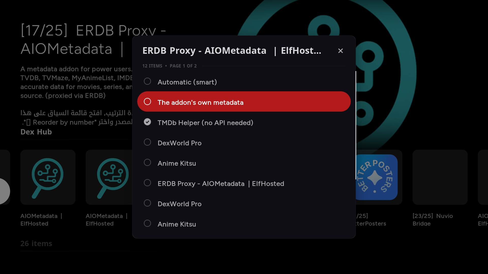
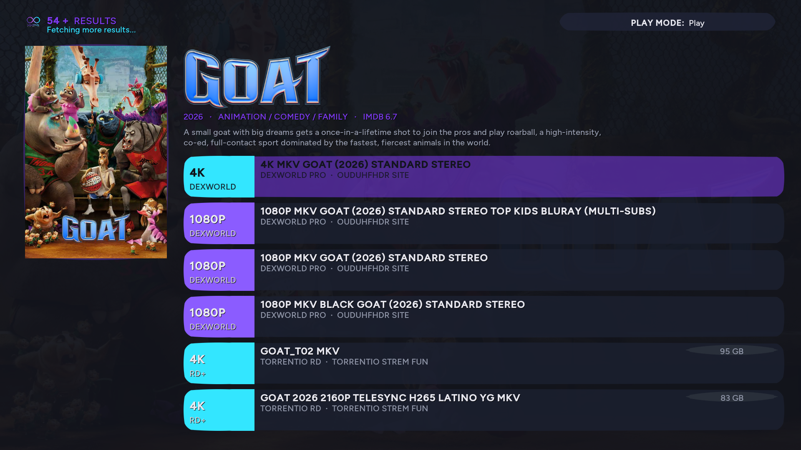
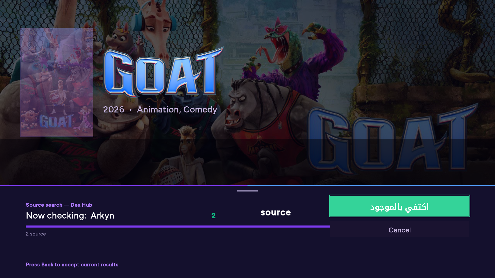
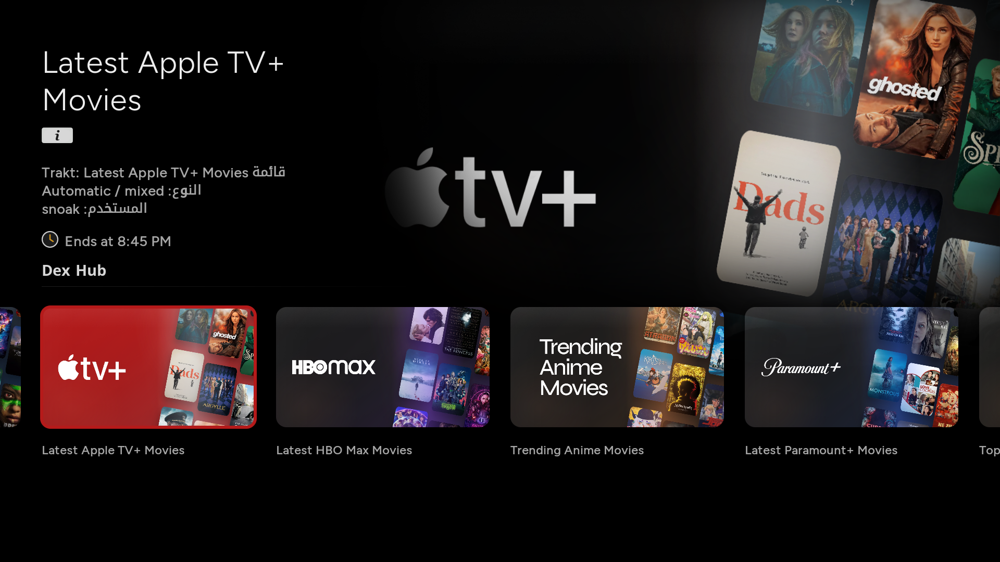
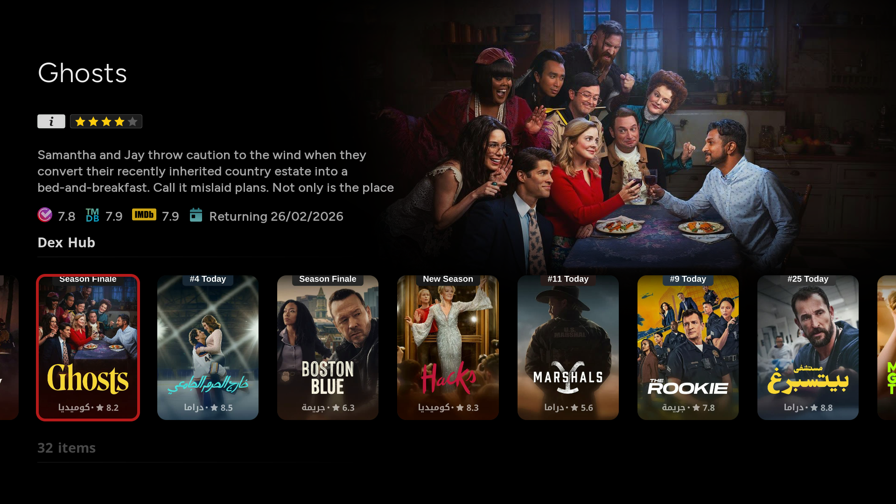

# Dex Hub

**A modern Stremio-style streaming experience for Kodi**

Multi-provider source aggregation · Native Trakt & MDBList · Arabic-first UI · TMDb Helper integration

[Install](#installation) · [Features](#what-makes-dex-hub-different) · [Screenshots](#screenshots) · [Roadmap](#roadmap)

---

## What makes Dex Hub different

Dex Hub brings the Stremio philosophy to Kodi without sacrificing what makes Kodi powerful. Instead of locking you into one provider, it races every Stremio addon you trust in parallel and shows you the first sources within a second — you click and watch.

- **Multi-provider parallel scanning** with a unified picker that ranks results by quality, language, and provider reliability
- **Native Trakt integration** — no third-party addon needed. Pin lists, sync history, browse trending, all from inside Dex Hub
- **Native MDBList support** for public lists, ratings, and curated collections
- **Fusion config import** — paste any Fusion Widgets URL and import dozens of Trakt lists in one tap
- **TMDb Helper player** auto-registration so your skin's TMDb widgets can hand off playback to Dex Hub
- **Arabic-first UI** with full RTL support, designed for Gulf and MENA viewers but works seamlessly in any language
- **Performance Boost preset** for low-end devices — one tap configures cache TTLs and lightweight mode for ARM 32-bit boxes
- **Quick-to-results** picker opens the moment the first source arrives, while remaining providers fill in live
- **Kodi 22 ready** — playback handoff uses the modern VideoInfoTag API exclusively, no deprecated calls

## Screenshots

<table>
  <tr>
    <td></td>
    <td></td>
  </tr>
  <tr>
    <td></td>
    <td></td>
  </tr>
  <tr>
    <td colspan="2"></td>
  </tr>
</table>

## Installation

Dex Hub supports Kodi 20 (Nexus), 21 (Omega), and 22 (Piers) on Android, Linux, Windows, macOS, CoreELEC, LibreELEC, and Fire TV.

1. Download the latest `plugin.video.dexhub-X.Y.Z.zip` from the [Releases page](../../releases/latest)
2. In Kodi, go to **Settings → System → Add-ons** and enable **Unknown sources**
3. Go to **Add-ons → Install from zip file** and select the downloaded ZIP
4. Open Dex Hub from your Video Add-ons menu

On first launch, follow the wizard to add a few Stremio addons (Cinemeta and Torrentio are good starters).

## Quick start

- **Add sources**: Settings → Add new source → paste any Stremio addon manifest URL
- **Import a Fusion collection**: Main menu → Collection → Add from JSON → paste a Fusion Widgets URL
- **Boost performance** (slow devices): Integrations → Performance Boost → Apply
- **Connect Trakt**: Integrations → Trakt → Connect

## Roadmap

- One-tap auto-play with quality preference profiles (Stremio-style)
- Auto-play next episode with countdown card
- Continue Watching row on home with source pre-fetching
- Quality badges (4K, HDR, DV, ATMOS, CACHED) in the picker

## Tech

Built in Python 3 on Kodi's xbmc
