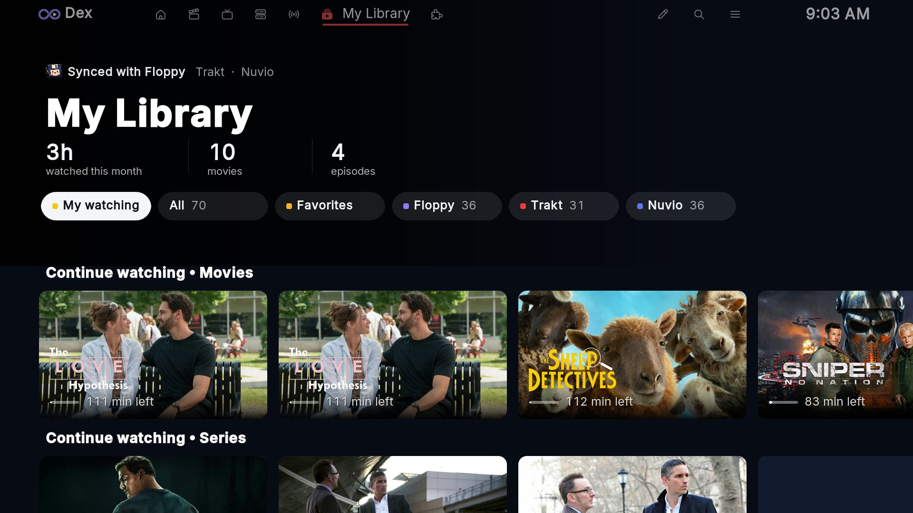
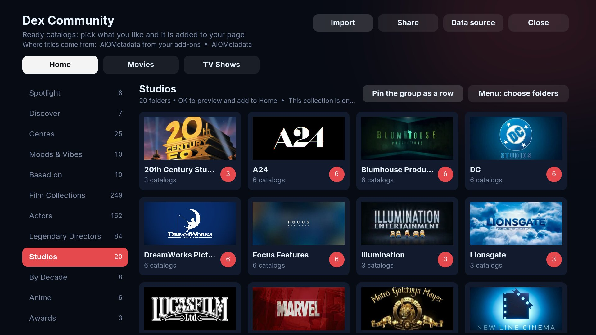
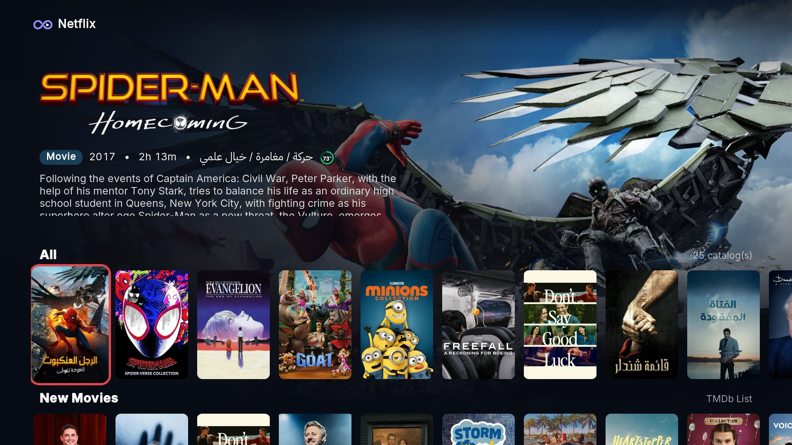
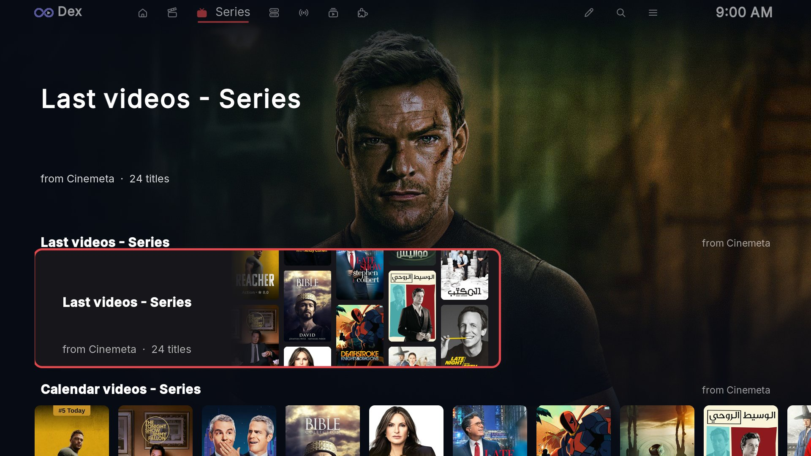
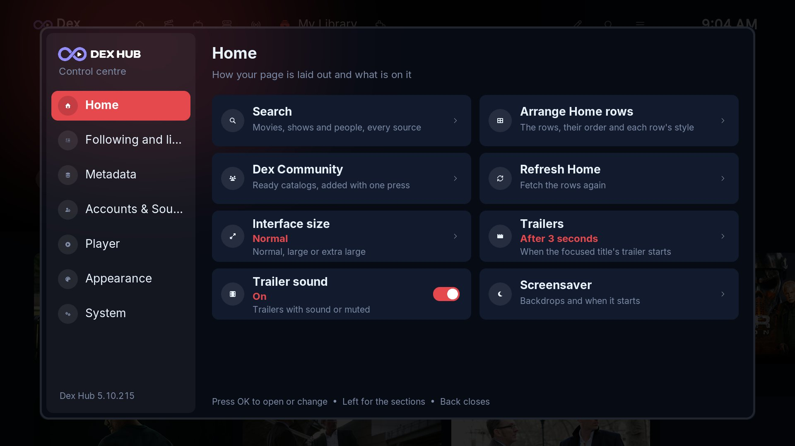
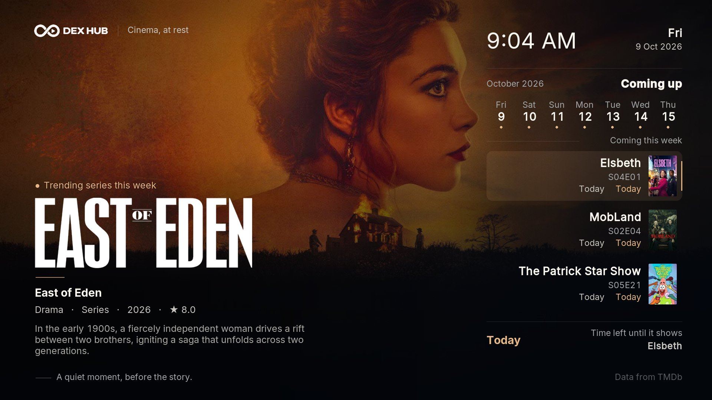

# Dex Hub

**A modern Stremio-style streaming experience for Kodi, with its own skin**

Stremio & Nuvio add-ons · Plex, Emby, Jellyfin & Silo · Live TV · Native Trakt, Simkl & MDBList · Arabic-first UI · TMDb Helper integration

[Install](#installation) · [What's new](#whats-new) · [Features](#what-makes-dex-hub-different) · [Skin](#the-dex-hub-skin) · [Screenshots](#screenshots) · [Support](#support-the-project)

## What's new

**Dex Hub 5.10.216 · Dex Hub skin 3.27.10**

* **My watching:** one page for Continue Watching, Up Next, your watchlists, an upcoming episodes calendar and "Because you watched". It filters by service and is also a chip in My Library.
* **Dex Community:** hundreds of ready made catalogs (studios, actors, directors, film collections, moods, decades) that you add to Home, Movies or Series in one press.
    * Import collections from a link or a JSON file (Kaptain, Nuvio and Fusion formats).
    * Share your whole setup as one file.
* **Control centre:** every setting in one organised menu: Home, Following and library, Metadata, Accounts & Sources, Player, Appearance and System.
* **Backup and restore:** pick what to keep (settings, sources, Home layout, collections, library, progress, accounts) and restore it any time.
* **Episode names and pictures:** the real episode names from TMDb, plus episode stills instead of the show poster. Both have a spoiler safe mode that only shows the episodes you've started.
* **Season names** like "Season 1: Murder House", and **watched ticks** on episodes, synced from Trakt.
* **Merge services:** a title shows once in Continue Watching and Next Up, even when it's in Trakt, Nuvio and your server at the same time.
* **Continue Watching:**
    * One row, or split into Movies and Series.
    * Sorted by recent, almost done or oldest.
* **Row styles gallery** with live previews: big banners with logos, Top 10 numbers, Spotlight cards and collection walls.
* **Cinema screensaver:** TMDb lists and a calendar of what's coming this week. You can browse it and open titles straight from it.
* **Faster everywhere:** progress reaches Trakt, Simkl and Nuvio while you watch, smart Trakt sync only pulls when something changed, and the Home loads the tab you're on first.

## What makes Dex Hub different

Dex Hub brings the Stremio philosophy to Kodi without sacrificing what makes Kodi powerful. Instead of locking you into one provider, it searches every source you trust in parallel and shows the first results within a second: you click and watch.

* **Stremio and Nuvio add-ons:** paste any Stremio or Nuvio add-on link, or sign in to Nuvio (QR login from your phone) and keep add-ons, collections, watch progress and your saved library in sync.
* **Your own servers:** Plex, Emby, Jellyfin and Silo, as libraries and as sources in the same picker. They show up right after you sign in.
* **Live TV:** an Xtream Codes account or an M3U playlist, with channel groups as Home rows, what is on now and next, a programme guide, VOD movies and series, and the channel playing behind the Home.
* **One unified source picker** with results grouped by type (Usenet, debrid, direct, Plex) and ranked by quality, language and provider. It shows Cached, Uncached or In your account, and its source line can follow your AIOStreams formatter.
* **Native Trakt, Simkl, MDBList and Floppy:** PIN linking, scrobbling, watched history, watchlists and your lists, no third-party add-on needed.
* **Continue Watching and Next Up** rows on the Home, quick play from the source you used last, and auto-play of the next episode (or Up Next, if you prefer it).
* **Subtitles that fit:** subtitles searched while you choose a source, your preferred languages first, AutoSync that fits any external subtitle to the timing of the one inside the video, and AI subtitles when you link DexWorld.
* **Metadata your way:** one metadata and artwork source for everything (AIOMetadata, TMDb, Cinemeta), Fanart.tv clearlogos, BetterPosters, IMDb and TMDb ratings and more, in Arabic or English.
* **TMDb Helper player:** one tap registers Dex Hub, so your skin's TMDb widgets hand playback to it.
* **Arctic Fuse 3 integration:** install Dex Hub's Home and pages into Arctic Fuse 3 in one tap (your skin is backed up first) and restore it whenever you like.
* **Collections:** build your own from your catalogs, or import Fusion Widgets, Kaptain or Nuvio JSON collections, with animated collection art.
* **28 themes**, from Dex Crimson and Midnight Ocean to OLED Black and Nuvio White.
* **Light on low-end boxes:** a one-tap speed profile, a quick lightweight setup and covers that load on focus, built to stay fast on CoreELEC and Zidoo boxes.
* **Arabic-first UI** with full RTL support, and English too.
* **Kodi 22 ready:** playback handoff uses the modern VideoInfoTag API, no deprecated calls.

## The Dex Hub skin

An optional skin made for Dex Hub. Kodi draws Dex Hub's Home itself, so it opens fast and stays smooth:

* a moving spotlight with trailers that slide the rows down Apple TV style, your Dex Hub rows and collection animations;
* a trailer or a live channel playing behind the whole Home;
* icon tabs, an Edit Home button and per-row styles;
* your Nuvio profile, Dex Hub's title pages, grids and My watching;
* quality badges in the player: Elite, Gold, Minimalist white or your own images;
* Arctic Fuse 3's video player, settings pages and dialogs, from ABUKARIM's copy with his CoreELEC player tools (PPI, Dolby Vision VS10) and Arabic font sets.

Install it from the Dex Hub repository (Look and feel → Skin), or turn it on from Dex Hub's settings with **Home → Dex Hub skin: use it** (it is installed from the repository when missing). **Home → Dex Hub skin: back to the skin used before it** takes you back. The skin needs Kodi 21 or later.

## Screenshots

<table>
  <tr>
    <td align="center"> Title page with episodes, progress and ratings</td>
    <td align="center"> Source picker with Cached status and badges</td>
  </tr>
  <tr>
    <td align="center"> My Library: every service in one place</td>
    <td align="center"> Dex Community: ready made catalogs</td>
  </tr>
  <tr>
    <td align="center"> Collections from your catalogs</td>
    <td align="center"> Spotlight cards for whole catalogs</td>
  </tr>
  <tr>
    <td align="center"> Control centre</td>
    <td align="center"> Cinema screensaver: what's coming this week</td>
  </tr>
</table>

## Installation

Dex Hub supports Kodi 21 (Omega) and 22 (Piers) on Android, Linux, Windows, macOS, CoreELEC, LibreELEC and Fire TV. The Dex Hub skin needs Kodi 21 or later.

### From the Dex Hub repository (recommended, updates arrive automatically)

1. In Kodi, go to **Settings → System → Add-ons** and enable **Unknown sources**.
2. Go to **Settings → File manager → Add source**, enter `https://dexworld.cc/dexhub/` and name it **Dex Hub**.
3. Go to **Add-ons → Install from zip file → Dex Hub** and pick the `repository.dexhub` zip.
4. Go to **Add-ons → Install from repository → Dex Hub Repository**, install **Dex Hub** from Video add-ons, then, if you want it, the **Dex Hub** skin from Look and feel → Skin.

### From zip files

Download both zips from the [latest release](../../releases/latest) and install them with **Add-ons → Install from zip file**: first `plugin.video.dexhub`, then `skin.dexhub`. Zip installs don't update themselves, so the repository is the better choice.

On first launch, Quick Start offers three ways in: connect Nuvio, add Stremio add-ons (Cinemeta and Torrentio are good starters), or set things up by hand.

## Quick start

In Dex Hub's Control centre:

* **Add a source:** Accounts & Sources → Add a source → paste a Stremio or Nuvio add-on link
* **Connect Nuvio:** Accounts & Sources → Connect & sync Nuvio
* **Add Live TV:** Accounts & Sources → Live TV (IPTV) → add your Xtream Codes account, or an M3U playlist through IPTV Simple
* **Connect Trakt:** Accounts & Sources → Trakt account & sync
* **Add ready made catalogs:** Home → Dex Community
* **Arrange your Home:** Home → Arrange Home rows
* **Back up your setup:** System → Backup and restore
* **Speed up a slow box:** System → Speed profile, one tap
* **Switch to the Dex Hub skin:** Home → Dex Hub skin: use it
* **Dex Hub inside Arctic Fuse 3:** Home → Dex Hub in Arctic Fuse 3: install or update
* **Choose player badges:** Player → Player badges / Badge pack

## Support the project

Dex Hub is built and maintained by one person in his free time. A big thank you to everyone who has supported it with a donation: you're the reason it keeps getting this much time, and many of the features above came from your suggestions and logs ❤️

If you'd like the updates to keep coming, you can support the project on **[Ko‑fi](https://ko-fi.com/dexworld)**.

Found a bug? Open an [issue](../../issues) and attach your full `kodi.log`. It helps a lot.

## Tech

Built in Python 3 on Kodi's own APIs (xbmc, xbmcgui, xbmcplugin, xbmcvfs), with no required third-party modules. A background service keeps the Home rows, account sync and player info up to date. The Dex Hub skin is plain Kodi skin XML based on Estuary, with Arctic Fuse 3's player and dialogs.

## Credits

* Dex Hub skin: based on Estuary by Team Kodi
* The skin's video player, settings pages and dialogs: Arctic Fuse 3 by jurialmunkey, from ABUKARIM's modified copy with his CoreELEC player tools and Arabic font sets
* Fonts: Inter, IBM Plex Sans Arabic, League Spartan and Font Awesome 6 Free
* Icons: Font Awesome Free and Simple Icons
* Badge packs: [Elite](https://github.com/leonevz/Elite-Badges) by leonevz, [Gold](https://github.com/k45sle/NUVIO_BADGES) by k45sle and [Minimalist white](https://github.com/sweatycab/nuvio-minimalist-badges) by sweatycab, downloaded from their own repositories when you pick them

## Disclaimer

The author of this add-on does not host any of the content which is found and has no affiliation with any of the content providers. The author is in no way affiliated with Kodi, Team Kodi, the XBMC Foundation, Stremio, Nuvio, Plex, Emby, Jellyfin, Silo, Trakt or TMDb.

## License

**Dex Hub (the add-on) is free to use on your own devices, with all rights reserved.** Redistributing it, modifying it, publishing a version based on it or bundling it with a paid service needs written permission. Read the full terms in [LICENSE.txt](LICENSE.txt). Third-party parts keep their own licences ([THIRD-PARTY-NOTICES.txt](THIRD-PARTY-NOTICES.txt)). Versions before 5.10.216 were released under the MIT license.

The Dex Hub skin keeps the licenses of the work it builds on: CC BY-SA 4.0 (Estuary), CC BY-NC-SA 4.0 (Arctic Fuse 3 player) and GPL 2.0.
