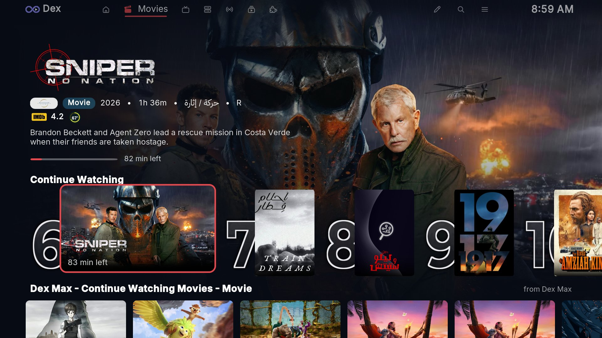
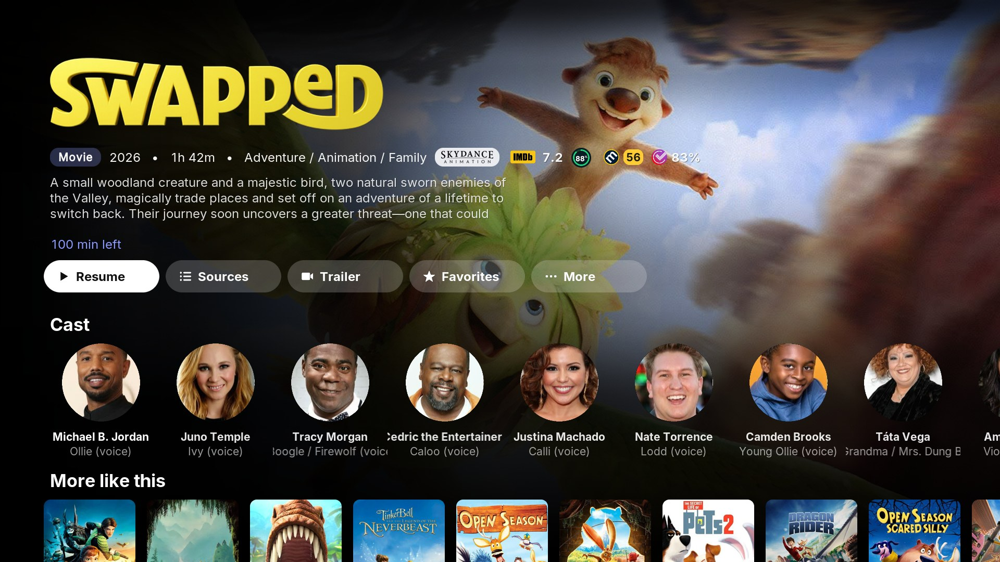
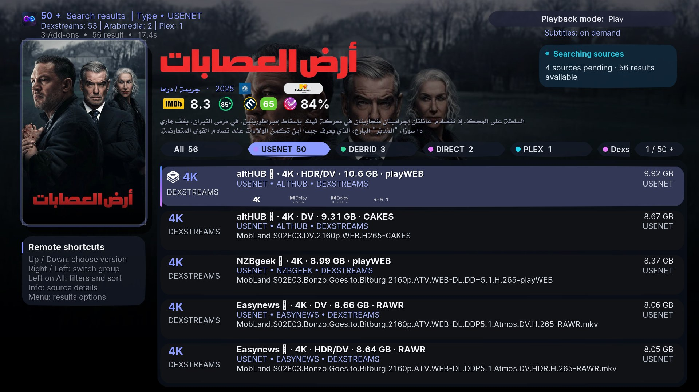
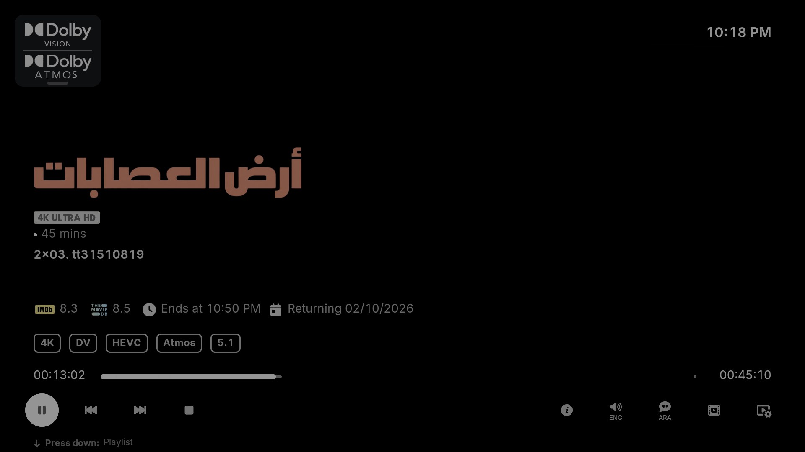
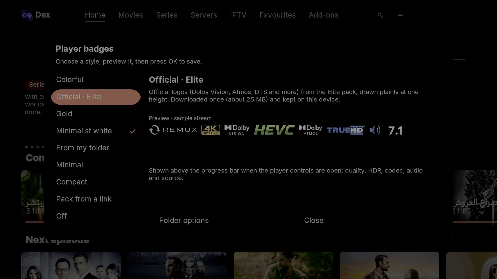

# Dex Hub

**A modern Stremio-style streaming experience for Kodi, now with its own skin**

Stremio & Nuvio add-ons · Plex, Emby, Jellyfin & Silo · Live TV · Native Trakt, Simkl & MDBList · Arabic-first UI · TMDb Helper integration

[Install](#installation) · [What's new](#whats-new) · [Features](#what-makes-dex-hub-different) · [Skin](#the-dex-hub-skin) · [Screenshots](#screenshots)

## What's new

**Dex Hub 5.10.142 · Dex Hub skin 3.19.1**

* **A dedicated skin, if you want it.** The new Dex Hub skin lets Kodi draw the Home itself, so Dex Hub opens faster and scrolls smoother. It is optional: Dex Hub keeps working as usual in any other skin.
* **Quality badges like the official logos.** Pick the Elite pack (official Dolby Vision, Atmos and DTS logos), Gold or Minimalist white, and every logo sits clean at one height with no plate behind it. A pack is downloaded once and kept on your device, so nothing is fetched while you watch.
* **Your own badges.** The "From my folder" style starts from the skin's badges; drop in an image with the same name to replace any of them.
* **A badge page** in the skin that previews every style before you choose.
* **Softer Home rows.** Unfocused rows fade lightly instead of turning grey, with a setting: light, none or strong.

## What makes Dex Hub different

Dex Hub brings the Stremio philosophy to Kodi without sacrificing what makes Kodi powerful. Instead of locking you into one provider, it searches every source you trust in parallel and shows the first results within a second: you click and watch.

* **Stremio and Nuvio add-ons**: paste any Stremio or Nuvio add-on link, or sign in to Nuvio (QR login from your phone) and keep add-ons, collections, watch progress and your saved library in sync
* **Your own servers**: Plex, Emby, Jellyfin and Silo, as libraries and as sources in the same picker
* **Live TV**: an Xtream Codes account or an M3U playlist, with channel groups as Home rows, what is on now and next, a programme guide, VOD movies and series, and the channel playing behind the Home
* **One unified source picker** with results grouped by type (Usenet, debrid, direct, Plex) and ranked by quality, language and provider, plus a source line formatter that can follow your AIOStreams formatter
* **Native Trakt, Simkl and MDBList**: PIN linking, scrobbling, watched history, watchlists and your lists, no third-party add-on needed
* **Continue Watching and Next Up** rows on the Home, quick play from the source you used last, and auto-play of the next episode (or Up Next, if you prefer it)
* **Subtitles that fit**: subtitles searched while you choose a source, your preferred languages first, AutoSync that fits any external subtitle to the timing of the one inside the video, and AI subtitles when you link DexWorld
* **Metadata your way**: one metadata and artwork source for everything, Fanart.tv clearlogos, BetterPosters, IMDb and TMDb ratings and more, in Arabic or English
* **TMDb Helper player**: one tap registers Dex Hub, so your skin's TMDb widgets hand playback to it
* **Arctic Fuse 3 integration**: install Dex Hub's Home and pages into Arctic Fuse 3 in one tap (your skin is backed up first) and restore it whenever you like
* **Collections**: import Fusion Widgets or Kaptain JSON collections, with animated collection art
* **28 themes**, from Dex Crimson and Midnight Ocean to OLED Black and Nuvio White
* **Light on low-end boxes**: a one-tap speed profile, a quick lightweight setup and covers that load on focus, built to stay fast on CoreELEC and Zidoo boxes
* **Arabic-first UI** with full RTL support, and English too
* **Kodi 22 ready**: playback handoff uses the modern VideoInfoTag API, no deprecated calls

## The Dex Hub skin

An optional skin made for Dex Hub. Kodi draws Dex Hub's Home itself, so it opens fast and stays smooth:

* a moving spotlight with trailers, your Dex Hub rows and collection animations
* a trailer or a live channel playing behind the whole Home
* your Nuvio profile, Dex Hub's title pages and grids
* quality badges in the player: Elite, Gold, Minimalist white or your own images
* Arctic Fuse 3's video player, settings pages and dialogs, from ABUKARIM's copy with his CoreELEC player tools (PPI, Dolby Vision VS10) and Arabic font sets

Install it from the DexWorld repository (Look and feel → Skin), or turn it on from Dex Hub's settings with **Home → Dex Hub skin: use it** (it is installed from the repository when missing). **Home → Dex Hub skin: back to the skin used before it** takes you back. The skin needs Kodi 21 or later.

## Screenshots

<table>
  <tr>
    <td align="center"> Title page</td>
    <td align="center"> Links and sources</td>
  </tr>
  <tr>
    <td align="center"> Quality badges in the player</td>
    <td align="center"> Badge style page</td>
  </tr>
</table>

## Installation

Dex Hub supports Kodi 20 (Nexus), 21 (Omega) and 22 (Piers) on Android, Linux, Windows, macOS, CoreELEC, LibreELEC and Fire TV. The Dex Hub skin needs Kodi 21 or later.

### From the DexWorld repository (recommended, updates arrive automatically)

1. In Kodi, go to **Settings → System → Add-ons** and enable **Unknown sources**
2. Go to **Settings → File manager → Add source**, enter `https://dexworld.cc/kodi/repository.dexworld/` and name it **DexWorld**
3. Go to **Add-ons → Install from zip file → DexWorld** and pick the `repository.dexworld` zip
4. Go to **Add-ons → Install from repository → DexWorld**, install **Dex Hub** from Video add-ons, then, if you want it, the **Dex Hub** skin from Look and feel → Skin

### From zip files

Install the add-on first, then the skin, with **Add-ons → Install from zip file**:

1. Add-on: [plugin.video.dexhub-5.10.142.zip](https://dexworld.cc/kodi/plugin.video.dexhub/plugin.video.dexhub-5.10.142.zip)
2. Skin (optional): [skin.dexhub-3.19.1.zip](https://dexworld.cc/kodi/skin.dexhub/skin.dexhub-3.19.1.zip)

Zip installs do not update themselves; the repository keeps both up to date. The install guide and the other DexWorld add-ons are at [dexworld.cc/kodi](https://dexworld.cc/kodi/).

On first launch, Quick Start offers three ways in: connect Nuvio, add Stremio add-ons (Cinemeta and Torrentio are good starters), or set things up by hand.

## Quick start

In Dex Hub's settings:

* **Add a source**: Sources → Add a source → paste a Stremio or Nuvio add-on link
* **Connect Nuvio**: Accounts → Connect & sync Nuvio
* **Add Live TV**: Sources → Live TV (IPTV) → add your Xtream Codes account, or an M3U playlist through IPTV Simple
* **Connect Trakt**: Accounts → Trakt account & sync
* **Speed up a slow box**: General → Speed profile, one tap
* **Switch to the Dex Hub skin**: Home → Dex Hub skin: use it
* **Dex Hub inside Arctic Fuse 3**: Home → Dex Hub in Arctic Fuse 3: install or update
* **Choose player badges**: Playback → Player badges / Badger pack

And in the add-on: **Main menu → Collection → Import a collection from JSON**, then paste a Fusion Widgets or Kaptain JSON link.

## Tech

Built in Python 3 on Kodi's own APIs (xbmc, xbmcgui, xbmcplugin, xbmcvfs), with no required third-party modules. A background service keeps the Home rows, account sync and player info up to date. The Dex Hub skin is plain Kodi skin XML based on Estuary, with Arctic Fuse 3's player and dialogs.

## Credits

* Dex Hub skin: based on Estuary by Team Kodi
* The skin's video player, settings pages and dialogs: Arctic Fuse 3 by jurialmunkey, from ABUKARIM's modified copy with his CoreELEC player tools and Arabic font sets
* Fonts: Inter, IBM Plex Sans Arabic, League Spartan and Font Awesome 6 Free
* Badge packs: [Elite](https://github.com/leonevz/Elite-Badges) by leonevz, [Gold](https://github.com/k45sle/NUVIO_BADGES) by k45sle and [Minimalist white](https://github.com/sweatycab/nuvio-minimalist-badges) by sweatycab, downloaded from their own repositories when you pick them

## Disclaimer

The author of this add-on does not host any of the content which is found and has no affiliation with any of the content providers. The author is in no way affiliated with Kodi, Team Kodi, or the XBMC Foundation.

## License

Dex Hub is released under the MIT license. The Dex Hub skin keeps the licenses of the work it builds on: CC BY-SA 4.0 (Estuary), CC BY-NC-SA 4.0 (Arctic Fuse 3 player) and GPL 2.0.
